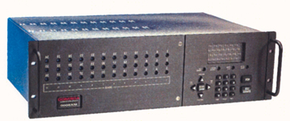
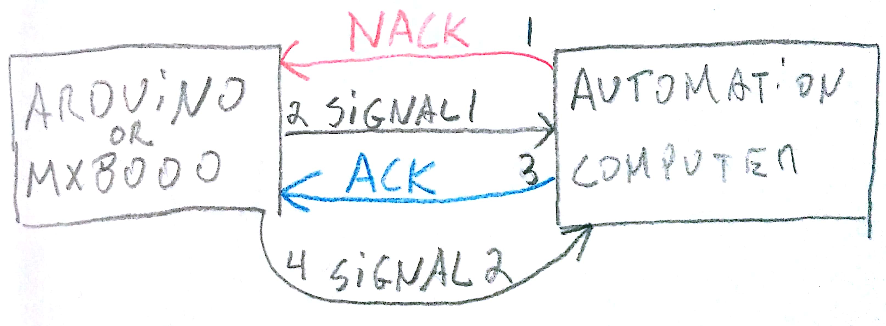

# Honeywell-MX8000-ACK-Emulator
This is a simple project to emulate the behavior of the receiver Honeywell MX8000 when ACKing and NACKing data

> Honeywell MX8000 Alarm Receiver

 # Explanation
"After the end of message byte (<$0D>) is sent by the receiver, the automation computer will respond with an ACK (<$06>) or NACK (<$15>). 
This response can be delayed between 1 byte time (depending on the baudrate) and the ACK timeout period.
If the receiver doesn’t get a response within the ACK timeout period or receive a NACK from the automation
computer, it will retransmit the data."

